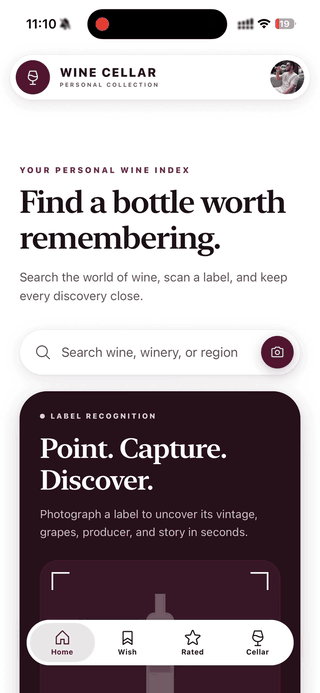

<p align="center">
  
</p>

<h1 align="center">Wine Cellar</h1>

<p align="center">
  A self-hosted, personal wine cellar for iOS, Android, and web.
</p>

<p align="center">
  
  
  
  
  
  
</p>

Search wines — your own catalog first, GPT research as a fallback — track what's in your cellar and wishlist, rate what you've tasted, and watch your cellar's temperature and humidity via a Tuya sensor. Every account brings its own OpenAI API key and Tuya credentials, encrypted at rest, and the whole thing runs on hardware you own: a homelab box behind [Tailscale](https://tailscale.com/), reachable from your phone with no public ports and no third-party backend in between.

<p align="center">
  
</p>

## Features

- **Wine search** — your own catalog first, GPT research as a fallback for anything new, deduplicated automatically.
- **Store prices** — prices come from real store listings (Brazilian stores first, stores abroad converted to BRL when no Brazilian store sells it), with links to each store.
- **Label scanner** — point the camera at a bottle and GPT reads the label to identify the wine.
- **Cellar & wishlist** — track what you own (with quantity) and what you want, synced across devices.
- **Tasting ratings** — a structured tasting form (intensity, balance, complexity, persistence, emotion) with an optional photo. Your rating is the only score in the app — no Vivino or critic scores.
- **Cellar climate** — live temperature/humidity from a Tuya-connected sensor, checked against your target range.
- **Passwordless login** — a one-time code by email (via Resend), no passwords to manage.
- **Own your data** — every account brings its own OpenAI API key and Tuya credentials (encrypted at rest); export/import your whole collection as a single archive.

## Architecture

```
 Expo app (iOS / Android / web)
        │  HTTPS (Tailscale)
        ▼
 Express API ──► Postgres
        ├──► Local disk (Docker volume) — label & tasting photos, served by the API
        ├──► OpenAI (per-user API key) — wine research, label reading
        ├──► Tuya Cloud (per-user credentials) — cellar temp/humidity
        ├──► Frankfurter (ECB rates, no key) — converting store prices abroad to BRL
        └──► Resend — one-time login codes by email
```

Every user account keeps its own OpenAI API key and Tuya credentials (encrypted at rest); the server is the only thing that talks to OpenAI, Tuya, Resend and Frankfurter — the app only ever talks to the server (plus store pages, when you tap a "Where to buy" link).

## Tech stack

| | |
| --- | --- |
| App | Expo (React Native + expo-router), TypeScript |
| API | Express 5, TypeScript (ESM) |
| Database | PostgreSQL via Prisma 7 (`@prisma/adapter-pg`) |
| Photo storage | Local disk (a Docker volume), for label & tasting photos |
| Auth | Passwordless email one-time codes (Resend) + JWT access/refresh |
| AI | OpenAI Responses API — wine research and label reading |
| IoT | Tuya Cloud OpenAPI — cellar sensor readings |
| Lint/format | [Biome](https://biomejs.dev/) via [Ultracite](https://www.ultracite.ai/) |
| Tests | Vitest + Supertest |

## Project structure

```
├── src/             Expo (React Native + expo-router) app
└── server/          Express + Prisma + Postgres API — see server/README.md
```

## Quickstart

```bash
cp server/.env.example server/.env
# fill in JWT_ACCESS_SECRET, JWT_REFRESH_SECRET, ENCRYPTION_KEY, RESEND_API_KEY, EMAIL_FROM
docker compose up --build
```

This starts Postgres + the API on `http://localhost:3000` (Swagger docs at `/docs`, health check at `/health`), running migrations automatically. Photos are stored in the `uploads` volume. See [`server/README.md`](server/README.md) for details, environment variables, and running it without Docker.

Then run the app:

```bash
pnpm install
EXPO_PUBLIC_API_URL=http://localhost:3000 pnpm start
```

## Deploying on a homelab

`docker-compose.yml` doesn't terminate TLS itself — put it behind [Tailscale Serve](https://tailscale.com/kb/1312/serve) (or your own reverse proxy) so it's reachable from outside your LAN without exposing any ports publicly. Point the app at your Tailscale MagicDNS name (`EXPO_PUBLIC_API_URL=http://your-machine:3000`) instead of `localhost` — or skip the rebuild and just change it from the app itself (gear icon on the login screen, or Preferences → Server), since the API URL is also stored on-device and can be updated at runtime.

Back up the `pgdata` and `uploads` Docker volumes together — together they hold everything. Upgrading is `git pull` + `docker compose up --build --remove-orphans`; migrations run on start. See [`server/README.md`](server/README.md#upgrading) for notes on specific upgrades.

## Development

- **Package manager**: pnpm workspaces (`server` is a workspace package; the app lives at the repo root). Don't mix in npm/yarn — `pnpm-lock.yaml` is the only lockfile.
- **Lint/format**: `pnpm lint` / `pnpm format` at the root, or `pnpm --filter server lint` for the server only.
- **Tests**: `pnpm --filter server test` — see [`server/README.md`](server/README.md#tests) for unit vs. integration tests and the throwaway-database setup they need.

## License

MIT — see [LICENSE](LICENSE).
