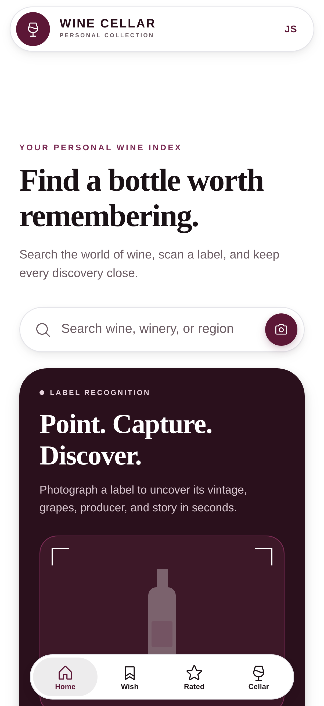
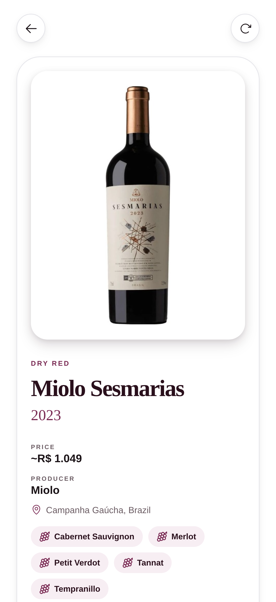
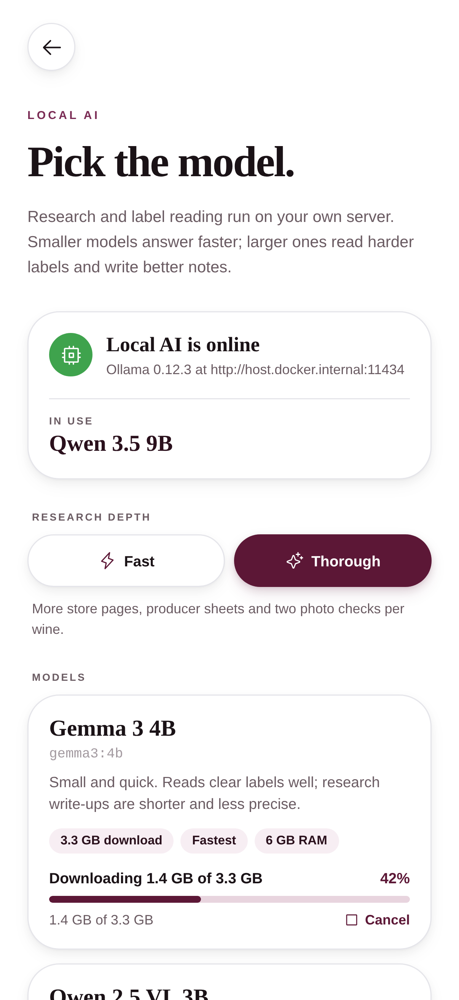

<p align="center">
  
</p>

<h1 align="center">Wine Cellar</h1>

<p align="center">
  A self-hosted, personal wine cellar for iOS, Android and the web, with wine research and label reading done by a local AI model on your own machine.
</p>

<p align="center">
  
  
  
  
  
  
  
</p>

Search for a wine, scan its label, keep what you own and what you want, rate what you taste, and watch the cellar's temperature and humidity. Everything runs on hardware you own: the API, the database, the photos and the AI. A homelab box or your Mac behind [Tailscale](https://tailscale.com/) is enough, with no public ports, no AI subscription and no third-party backend.

## Screenshots

<p align="center">
  
  &nbsp;
  
  &nbsp;
  
</p>

<p align="center">
  All 14 screens, captured at iPhone 17 size from a mocked API: <a href="docs/screenshots.md"><strong>docs/screenshots.md</strong></a>
</p>

## Features

- **Catalog search that comes back instantly.** Words in any order, accents ignored, matching name, producer, region, country, grape and vintage. Queries you researched before are remembered, so a repeated search never hits the model twice.
- **Web research by a local model.** Anything new is researched on the web through a self-hosted SearXNG and written up by a model running on [Ollama](https://ollama.com/). Research runs as a background job with a live stage, a percentage and a stop button. A *Search the web for more* action lets you go further even when the catalog already had something.
- **Label scanner.** Point the camera at a bottle: the vision model reads producer, name and vintage, and double-checks a doubtful reading against the web before researching it.
- **Choose the model from the app.** Preferences → AI model lists curated multimodal models with size, speed and memory needs, shows what is installed, downloads a new one on the server with progress, and switches to it when done. Any Ollama model name works too. A *Fast* / *Thorough* switch trades research depth for time.
- **Store prices, not guesses.** Prices come from real store listings (Brazilian stores first, stores abroad converted to BRL only when no Brazilian store sells the wine), listed under *Where to buy* with links.
- **Bottle photos.** New wines get a store's catalog photo that the vision model verified shows that exact wine, trimmed so the bottle fills the frame. A scanned label is the fallback and an illustration of the wine's style the last resort.
- **Cellar, wishlist and tastings.** Bottle counts, a wishlist and a structured tasting form (score, intensity, balance, complexity, persistence, emotion and sensory notes, with an optional photo). Lists refresh with a pull.
- **Cellar climate.** Live temperature and humidity from a Tuya sensor, checked against your targets.
- **Passwordless login and your own data.** One-time codes by email, Tuya secrets encrypted at rest, a full export/import of your collection, and a health endpoint that reports the database, Ollama and SearXNG.

## How it fits together

```
 Expo app (iOS / Android / web)
        │  HTTPS (Tailscale)
        ▼
 Express API ──► PostgreSQL (catalog, collections, settings, search memo)
        ├──► Local disk (Docker volume): label, store and tasting photos
        ├──► Ollama on the host: research write-ups, label reading, photo checks, model downloads
        ├──► SearXNG (container): web search for stores and producer pages
        ├──► Tuya Cloud: cellar temperature and humidity
        ├──► Frankfurter: exchange rates for stores abroad
        └──► Resend: one-time login codes
```

The app only ever talks to the API. The API is the only thing that talks to Ollama, SearXNG, Tuya, Frankfurter and Resend. See [docs/architecture.md](docs/architecture.md) for the layering inside each side.

## Quickstart

1. Install [Ollama](https://ollama.com/) on the machine that will run the stack. It runs natively so it can use the GPU. You do not need to pull a model by hand: the app downloads the one you pick, but pulling the default ahead of time saves a wait on the first search.

   ```bash
   brew install ollama && brew services start ollama   # or see ollama.com/download
   ollama pull qwen3.5:9b
   ```

2. Configure and start the API, Postgres and SearXNG:

   ```bash
   cp server/.env.example server/.env
   # fill in JWT_ACCESS_SECRET, JWT_REFRESH_SECRET, ENCRYPTION_KEY, RESEND_API_KEY, EMAIL_FROM
   echo "SEARXNG_SECRET=$(openssl rand -hex 32)" > .env
   docker compose up --build
   ```

   The API listens on `http://localhost:3000` with Swagger UI at `/docs` and a health report at `/health`. Migrations run on start.

3. Run the app:

   ```bash
   pnpm install
   EXPO_PUBLIC_API_URL=http://localhost:3000 pnpm start
   ```

   The API address can also be changed inside the app (gear icon on the login screen, or Preferences → API server).

4. Pick a model in Preferences → AI model, or keep the default `qwen3.5:9b`.

On a Linux box you share with other work, `scripts/bin/wine-cellar start|stop|status` brings Ollama and the whole stack up or down with one command (see [docs/deployment.md](docs/deployment.md)).

## Documentation

| Document | What it covers |
| --- | --- |
| [docs/architecture.md](docs/architecture.md) | Layers, modules, design patterns and the reasoning behind them |
| [docs/api.md](docs/api.md) | Every endpoint, background jobs, error codes |
| [docs/ai-models.md](docs/ai-models.md) | Choosing, downloading and switching models; the curated list; research depth |
| [docs/research-pipeline.md](docs/research-pipeline.md) | How a search or a label scan becomes a catalog record, pricing and photos |
| [docs/development.md](docs/development.md) | Toolchain, scripts, tests, lint rules, code conventions |
| [docs/deployment.md](docs/deployment.md) | Docker, Tailscale, environment variables, backups, upgrades |
| [docs/screenshots.md](docs/screenshots.md) | Every screen, and how to regenerate the images |
| [server/README.md](server/README.md) | API package overview |

## Development at a glance

```bash
pnpm lint                      # Biome (app + scripts)
pnpm typecheck                 # TypeScript, app
pnpm test                      # Vitest, app utilities and services
pnpm --filter server lint      # Biome, API
pnpm --filter server typecheck # TypeScript, API
pnpm --filter server test      # Vitest, API (unit + integration against a throwaway Postgres)
pnpm screenshots               # Regenerate docs/screenshots from a mocked API
```

Conventions: pnpm workspaces only, strict TypeScript, no comments in code (names and tests carry the meaning), clean architecture boundaries described in [docs/architecture.md](docs/architecture.md).

## License

MIT, see [LICENSE](LICENSE).
