# Screenshots

Every screen of the app, captured from the web build at iPhone 17 size (402 × 874 points at 3×, so 1206 × 2622 pixels) against a mocked API. The wines, prices, sensor readings and download progress are fixtures, so the pictures show every state without a running server.

## Sign in and home

<p>
  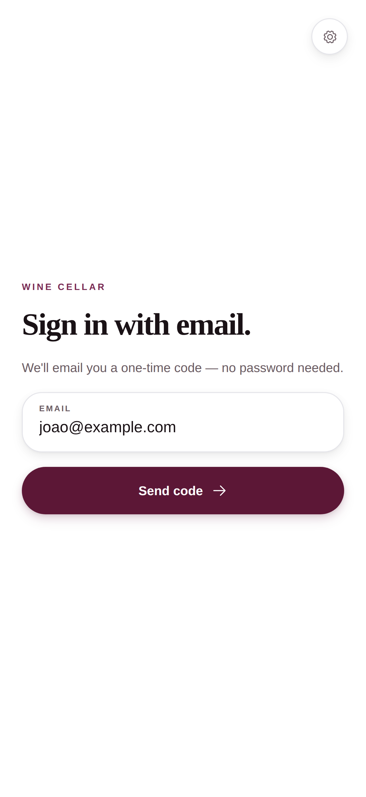
  &nbsp;
  
</p>

## Search

Catalog results answer at once and offer a web search for more. Web research shows the stage the model is at, a percentage and a stop button.

<p>
  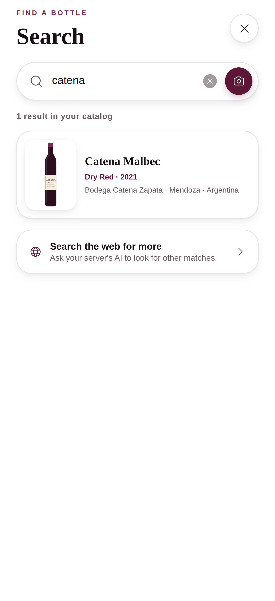
  &nbsp;
  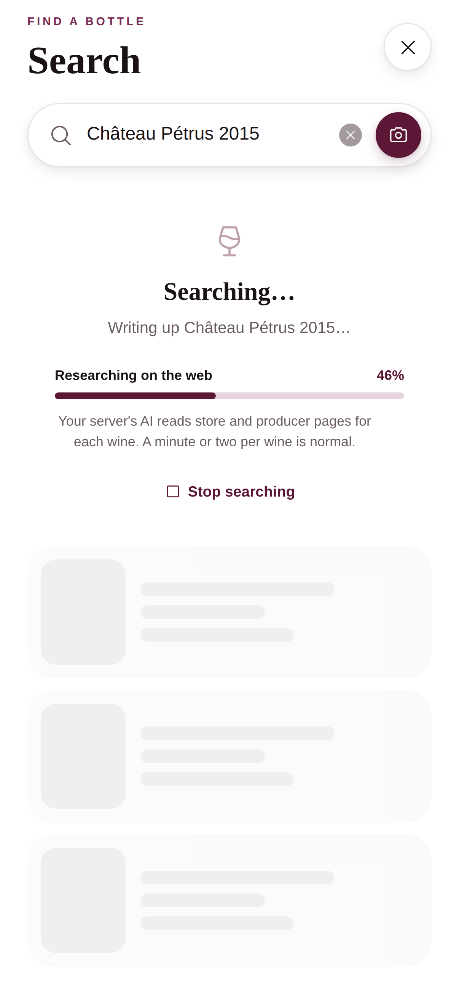
  &nbsp;
  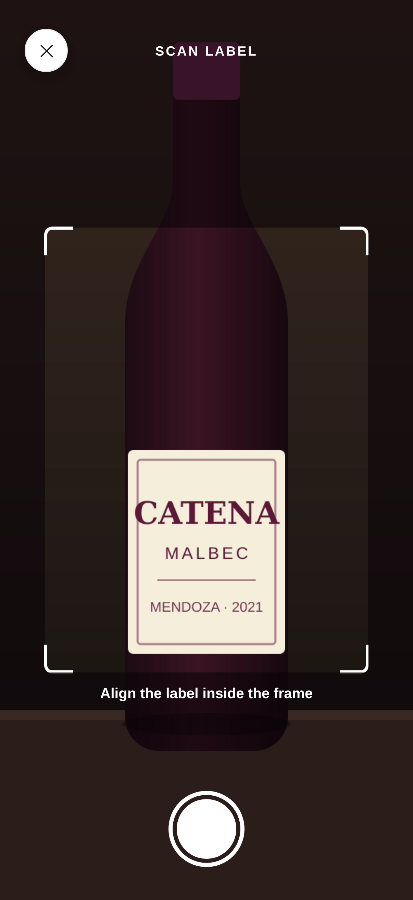
</p>

## A wine

<p>
  
  &nbsp;
  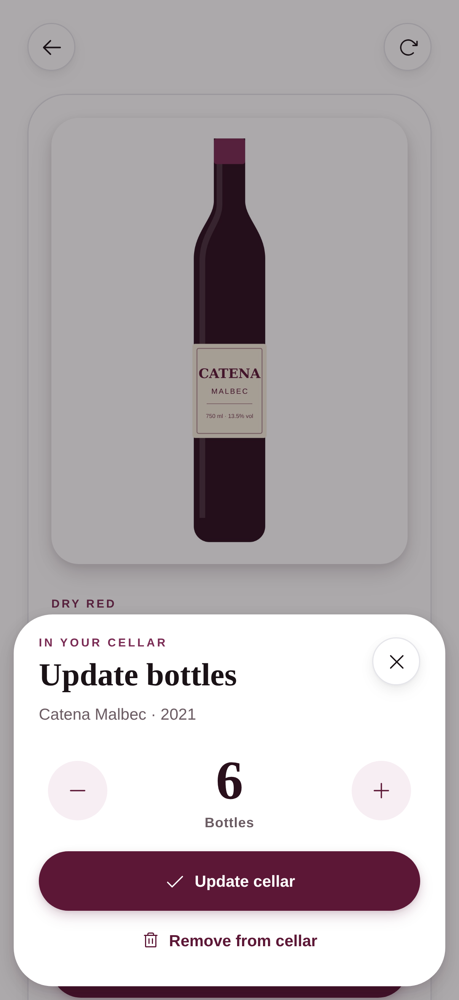
  &nbsp;
  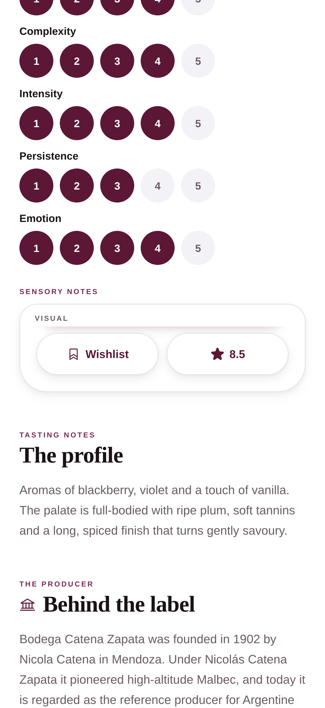
</p>

## Collections

<p>
  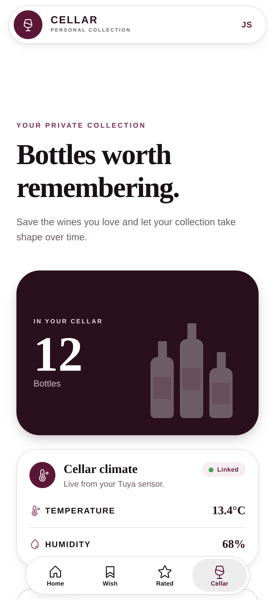
  &nbsp;
  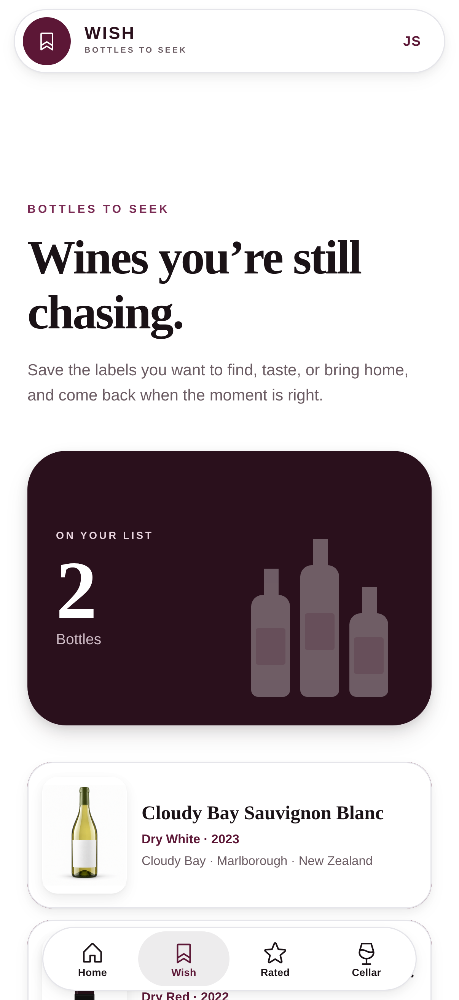
  &nbsp;
  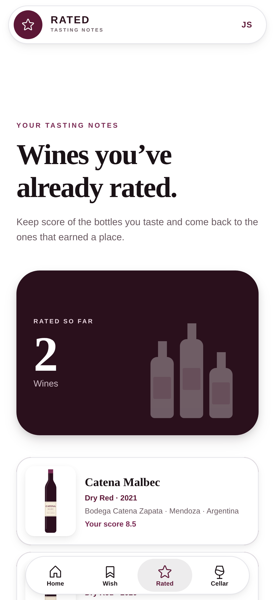
</p>

## Settings

<p>
  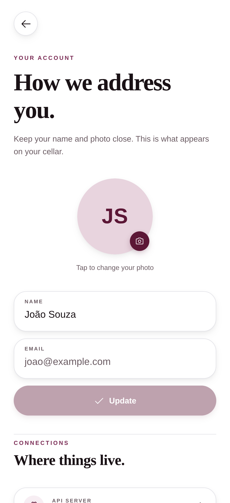
  &nbsp;
  
  &nbsp;
  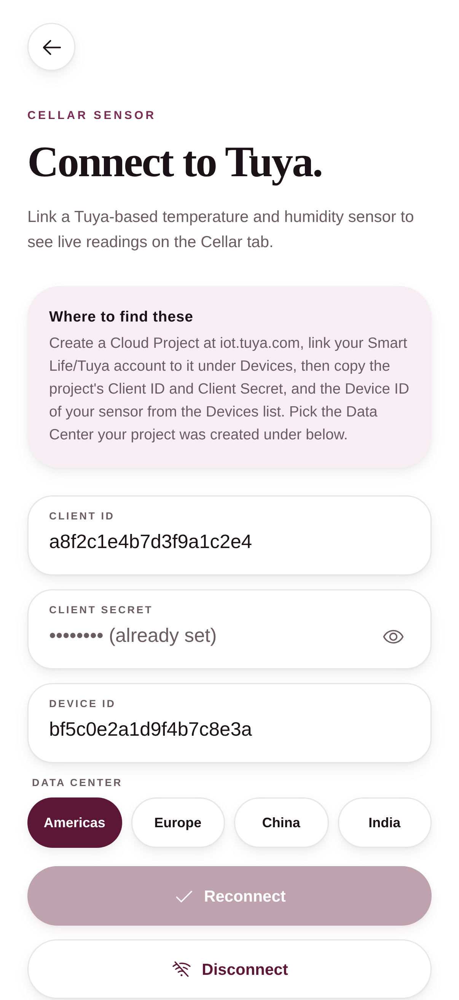
</p>

## Regenerating

The images come from `scripts/screenshots/`, which serves a web export of the app, intercepts every API call with fixtures (`fixtures.mjs`, `mock-api.mjs`), feeds a rendered bottle to the browser's fake camera (`fake-camera.mjs`) and drives the screens with Playwright at the iPhone 17 viewport.

```bash
npx expo export --platform web --output-dir .expo-web-dist
pnpm screenshots
```

Set `CHROMIUM_PATH` when Playwright's own browser is not installed, and `SCREENSHOT_DIR` to write somewhere other than `docs/screenshots`.
